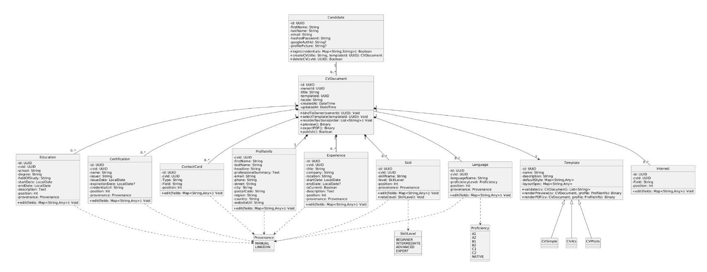

# Document d’Architecture

## Introduction

Le présent document d’architecture décrit la conception technique et logicielle de l’application **LinkedIn2CV**, un site web permettant de générer automatiquement un **CV PDF** à partir des données issues du profil **LinkedIn** de l’utilisateur.

Ce document présente l’ensemble des éléments constituant l’architecture du système :

- Le **contexte fonctionnel** du projet et ses principaux cas d’usage  
- La **stack technologique** retenue, incluant :
  - le front-end (**Vue.js**)
  - le back-end (**Fastify** avec **TypeScript**)
  - la base de données (**PostgreSQL** avec **Prisma**)
  - le stockage cloud (**Firebase Storage**)
- L’organisation logicielle du code côté serveur  
- Les modèles de données, **diagrammes UML**, **séquences d’interactions** et **schéma relationnel** de la base  

L’ensemble de ces éléments vise à garantir une **architecture modulaire, scalable et maintenable**, répondant aux standards actuels du développement web et à la facilité d’évolution du produit.

---

## Vue des Cas d’Usage 

---

## Description du Stack

L’architecture du projet repose sur une **stack moderne et performante**, combinant un front-end réactif, un back-end léger et une base de données robuste, le tout déployé sur des services cloud fiables.

### Front-end : Vue.js

- Développé avec **Vue.js**, un framework JavaScript progressif axé sur la **réactivité** et la **simplicité**.  
- Offre une interface fluide, dynamique et responsive.  
- Déployé via **Vercel**, assurant CI/CD, hébergement rapide et HTTPS automatique.

### Back-end : Fastify avec TypeScript

- Construit avec **Fastify**, framework Node.js haute performance.  
- Fournit des endpoints **RESTful**, organisés par modules (handlers, services, middlewares).  
- Assure une communication fluide avec le front-end Vue.js.

### Base de données : PostgreSQL avec Prisma

- Stockage via **PostgreSQL**, base robuste et conforme ACID.  
- Accès géré par **Prisma ORM**, facilitant les requêtes et la cohérence des schémas.

### Cloud Storage : Firebase Storage

- Gère le **stockage des fichiers** (images, CVs, documents, etc.).  
- Solution **sécurisée, scalable**, avec gestion centralisée des accès.  
- Intégration fluide avec le back-end Fastify.

---

## Organisation des Packages

### Structure du Frontend

| Dossier / Fichier | Rôle / Description |
|--------------------|--------------------|
| `node_modules/` | Dépendances installées via Yarn. Ne jamais modifier manuellement. |
| `public/` | Fichiers statiques accessibles directement (images, favicon…). |
| `index.html` | Point d’entrée principal chargé par Vite. |
| `vite.config.ts` | Configuration de Vite (alias, proxy, plugins). |
| `package.json` | Liste des dépendances et scripts (`yarn dev`, `yarn build`), et métadonnées du projet. |
| `tsconfig.json` | Configuration TypeScript. |
| `yarn.lock` | Verrouillage des versions des dépendances. |
| `src/` | Dossier principal du code source Vue. Contient toute la logique applicative. |
| `src/main.ts` | Point d’entrée de l’app Vue. |
| `src/App.vue` | Composant racine (layout global). |
| `src/assets/` | Fichiers statiques importés (images, CSS…). |
| `src/components/` | Composants réutilisables (Navbar, Footer…). |
| `src/views/` | Pages principales du routeur. |
| `src/router/` | Configuration du **Vue Router**. |
| `src/store/` | Gestion d’état globale (Pinia/Vuex). |
| `src/services/` | Appels API (auth, user, CV…). |
| `src/env.d.ts` | Types spécifiques à l’environnement Vite. |

---

### Structure de l’API (Fastify)

| Dossier / Fichier | Rôle / Description |
|--------------------|--------------------|
| `handlers/` | Contient les fonctions de gestion des routes (controllers). Chaque handler exécute la logique métier lorsqu’une requête est reçue (ex. création d’un utilisateur, récupération d’un CV, etc.). |
| `middlewares/` | Regroupe les middlewares Fastify exécutés avant ou après les routes. Ils gèrent l’authentification, la validation des tokens, les erreurs globales ou la configuration CORS. |
| `models/` | Contient les définitions des modèles de données correspondant aux tables de la base (Users, CVs, Experiences, etc.), utilisés pour interagir avec la base via Prisma. |
| `routers/` | Centralise la définition des routes de l’API. Chaque fichier correspond à un module et associe les routes HTTP à leurs handlers respectifs. |
| `services/` | Contient la logique métier réutilisable et indépendante des routes. Ces services gèrent les opérations complexes (ex. génération de CV, synchronisation avec LinkedIn, appels externes, etc.). |
| `errors/` | Centralise la gestion des erreurs de l’application. Contient les erreurs personnalisées (NotFoundError, UnauthorizedError, etc.) et les gestionnaires globaux pour uniformiser les réponses HTTP. |
| `prisma/` | Regroupe les fichiers liés à Prisma, l’ORM utilisé pour interagir avec la base de données. Contient le fichier schema.prisma, les migrations et la configuration du client Prisma. |
| `utils/` | Contient les fonctions utilitaires réutilisables (formatage, manipulation de dates, génération de tokens, validation, etc.). |
| `logs/` | Journaux d’accès, d’erreurs et de performance. |
| `tests/` | Tests unitaires et d’intégration. |
| `main.js` | Point d’entrée principal de l’application. Initialise le serveur Fastify, charge les plugins, routes et middlewares, puis démarre l’API. |

---

## Diagramme de Classes 

Le diagramme de classes décrit la **structure métier** de l’application.  
Chaque classe correspond à une composante fonctionnelle (utilisateurs, CV, expériences, etc.).

###  Description des classes principales

| **Classe / Enum** | **Rôle / Description** | **Relations principales** |
|--------------------|-------------------------|-----------------------------|
| **Candidate** | Représente l’utilisateur de l’application. Il gère son compte, son authentification et la création de ses CV. | 1 → 0..** CVDocument (un utilisateur possède plusieurs CV) |
| **CVDocument** | Correspond à un CV complet et personnalisable : il regroupe les sections (expériences, formations, etc.) et permet le rendu en PDF. | 1 → 1 Template ; 1 → 1 ProfileInfo ; 1 → 0..** Experience, Education, Skill, Language, Certification, ContactCard, Interest ; relié à Candidate |
| **Template (abstraite)** | Définit la mise en page, les styles et la logique de rendu des CV. | Référencée par CVDocument ; spécialisée par CVSimple, CVAts, CVPhoto |
| **CVSimple / CVAts / CVPhoto** | Modèles concrets de CV (simple, optimisé ATS, avec photo). | Héritent de Template, utilisés par CVDocument |
| **ProfileInfo** | Informations personnelles liées à un CV : nom, résumé, coordonnées et adresse. | 1 ← 1 CVDocument (relation 1-1) |
| **Experience** | Décrit une expérience professionnelle : poste, entreprise, dates, description et ordre d’affichage. | 1 ← * CVDocument (composition) ; dépend de Provenance |
| **Education** | Représente une formation ou un diplôme : établissement, domaine, période, description. | 1 ← * CVDocument (composition) ; dépend de Provenance |
| **Skill** | Décrit une compétence du candidat, avec un niveau et un ordre d’affichage. | 1 ← * CVDocument (composition) ; dépend de SkillLevel et Provenance |
| **Language** | Représente une langue maîtrisée et son niveau (A1 à C2 ou natif). | 1 ← * CVDocument (composition) ; dépend de Proficiency et Provenance |
| **Certification** | Indique une certification ou un titre obtenu, avec organisme, date et lien. | 1 ← * CVDocument (composition) ; dépend de Provenance |
| **ContactCard** | Carte de contact ou référence affichée dans le CV (nom, entreprise, poste, lien LinkedIn). | 1 ← * CVDocument (composition) ; dépend éventuellement de Provenance |
| **Interest** | Centre d’intérêt ou activité personnelle (nom, catégorie, source). | 1 ← * CVDocument (composition) |
| **Provenance (enum)** | Indique la provenance d’une donnée (saisie manuelle ou importée depuis LinkedIn). | Utilisé par Experience, Education, Skill, Language, Certification, ContactCard |
| **SkillLevel (enum)** | Définit le niveau de maîtrise d’une compétence (Beginner → Expert). | Utilisé par Skill |
| **Proficiency (enum)** | Définit le niveau de compétence linguistique selon l’échelle CEFR (A1 → C2, NATIVE). | Utilisé par Language |

---

## Diagrammes de Séquence

Les diagrammes de séquence illustrent le déroulement des interactions entre les différents composants du système **LinkedIn2CV** pour des cas d’usage clés.  
Ils permettent de visualiser l’ordre des opérations, les échanges de données et la logique de traitement pour chaque fonctionnalité.  

Dans ce projet, trois diagrammes de séquence principaux sont présentés :  
1. **Authentification** :  

2. **Génération de CV** : 

3. **Personnalisation du CV** : 

---

## Diagramme de Base de Données

Le schéma relationnel montre la structure des tables et leurs relations.

### Description des tables principales

| **Table** | **Rôle / Description** | **Relations principales** |
|------------|-------------------------|-----------------------------|
| **Users** | Sert à gérer les comptes utilisateurs de l’application. Chaque utilisateur possède ses informations personnelles et d’authentification. | 1 → * CVs (un utilisateur peut avoir plusieurs CV) |
| **CVs** | Représente un CV appartenant à un utilisateur. C’est la table centrale qui relie toutes les sections de contenu (expériences, formations, compétences, etc.) ainsi que le profil principal. | * ← 1 Users ; 1 → * Experiences, Educations, Skills, Languages, Certifications, Contacts, Interests ; 1 → 1 ProfileInfos |
| **Experiences** | Regroupe les expériences professionnelles associées à un CV (poste, entreprise, période, description). | * ← 1 CVs (relation 1-N) |
| **Educations** | Contient les formations liées à un CV (établissement, diplôme, dates, description). | * ← 1 CVs (relation 1-N) |
| **Skills** | Liste les compétences présentes dans un CV. | * ← 1 CVs (relation 1-N) |
| **Languages** | Gère les langues maîtrisées par le candidat pour un CV donné. | * ← 1 CVs (relation 1-N) |
| **Certifications** | Stocke les certifications obtenues et rattachées à un CV. | * ← 1 CVs (relation 1-N) |
| **Contacts** | Permet d’associer au CV des contacts ou références professionnelles (nom, entreprise, poste, lien LinkedIn). | * ← 1 CVs (relation 1-N) |
| **Interests** | Regroupe les centres d’intérêt et activités personnelles affichés dans le CV. | * ← 1 CVs (relation 1-N) |
| **ProfileInfos** | Contient les informations principales du profil pour un CV (identité, résumé, coordonnées). | 1 ← 1 CVs (relation 1-1) |

---
